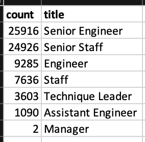
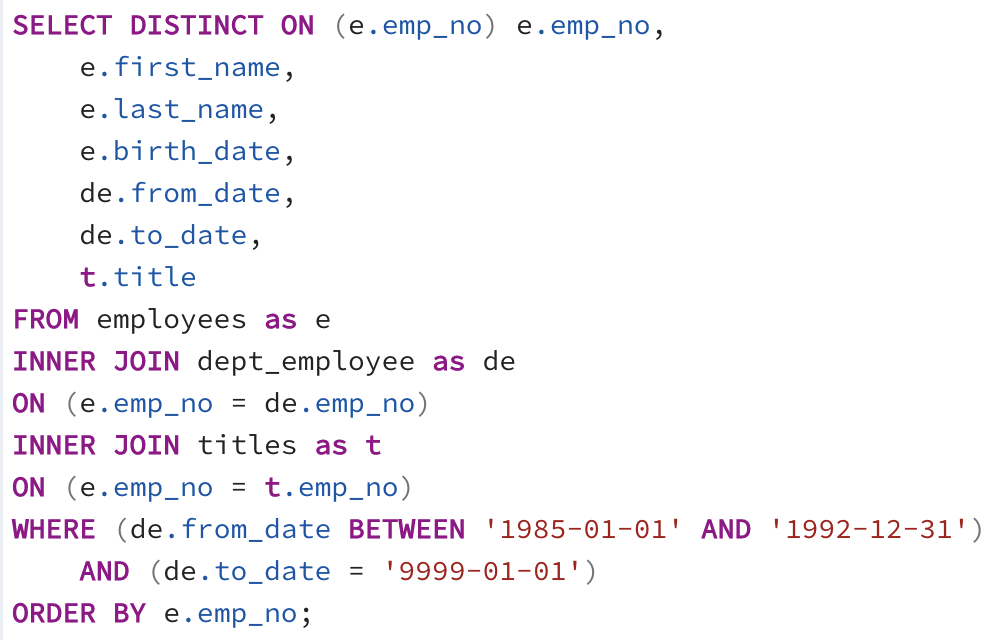
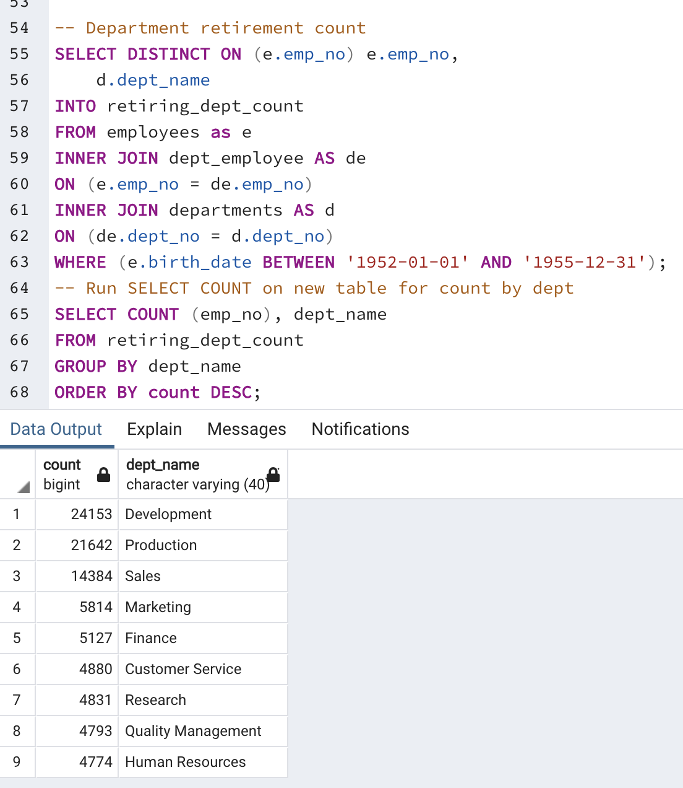

# Pewlett-Hackard-Analysis

## Overview 
There is a "silver tsunami" coming to Pewlett Hackard with tens of thousands of employees eligible for retirement soon. The purpose of this analysis is to determine who the potential retirees are and identify potential candidates to replace them. 

## Results
### Deliverable 1: The Number of Retiring Employees by Title
I created a Retirement Titles table that holds all the titles of employees who are of eligible retirements age: those born between January 1, 1952 and December 31, 1955. I used the DISTINCT ON statement to find the most recent title of each employee and eliminate redundancies of employees who had multiple titles due to promotions or transfers. Using the COUNT function, I created a table that has the number of potential reitrees by most recent job title and then removed the emoployees who have already left the company. The results for count of employees eligible for retirement by department can be found in retiring_titles.csv.

### Deliverable 2: The Employees Eligible for the Mentorship Program
To find employees eligible for the Mentorship Program, I pulled data from the employees, dept_employee, and titles tables. I filtered the return to employees born in the year 1965 that are still currently employed by the company and then sorted the results by employee number. The results can be found in mentorship_eligibility.csv.

### Major Findings
- Output 1: retirement_titles.csv
  - Compiling data from data from the employees and titles table and filtering for employees of retirement age (born 1952-1955), we get a large number of "eligible retirees": 133,776.This data is not entirely accurate since it is accounting for employees who have already retired and counts some employees more than once if their titles have changed over time.
- Output 2: unique_titles.csv
  - I further filtered the data using DISCTINCT ON and changing parameters to only include employees that have not left the company. This returned an individual entry for each current employee at the company eligible for retirement, which turned out to be 72,458 employees.
- Output 3: retiring_titles.csv
  - To help leadership prepare for the number of roles that may be opening due to upcoming retirements, I created another table to capture the count of employees per title which is also pictured below.
    | *Retiring Titles* |
    | :--:|
    |  |
    

- Output 4: mentorship_eligibility.csv
  - To bettter prepare for the "silver tsunami", potential candidates have been identified to begin training. The final table provides all current employees born in the year 1965 - a total of 1,549 employees.

## Summary
The queries run on the data show that 72,458 roles will need to be filled once the silver tsunami starts. Only considering employees born in 1965 as qualified, retirement-ready employees gives us 1,549 potential employees, which is not nearly enough. My recommendation for further queries:
- Increase the Mentorship Eligibility to anyone who has been with the company for more than 10 years. Run a query joining data from employees, dept_employee, and title and rather than choosing employees born in the year 1965, select those who have at least 10 years with the company. Since the last hire date is in 2002, I assumed 1992 was the 10 year mark and ran the following query, which returned 117,410 potential mentors.
   | *Alternative Mentorship Query* |
   | :--: |   
   |  |
- To provide individual departments better insight into openings they will need to fill, I would also recommend running a query to show count of roles eligible for retirement by department name.
   | *Retirement Count by Department* |
   | :--: |
   |  |
   
   
